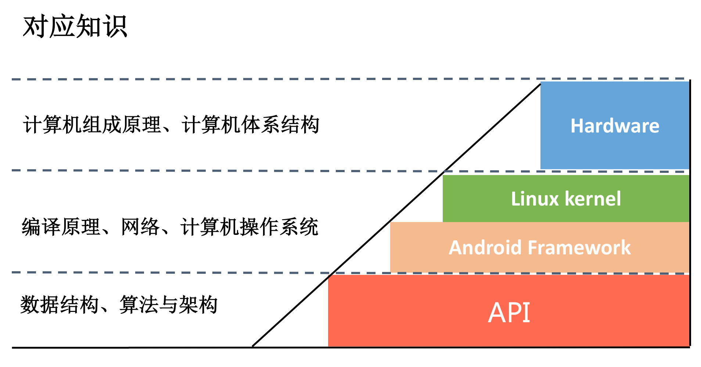
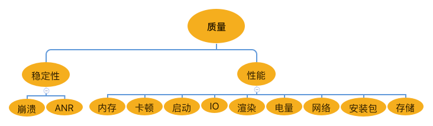
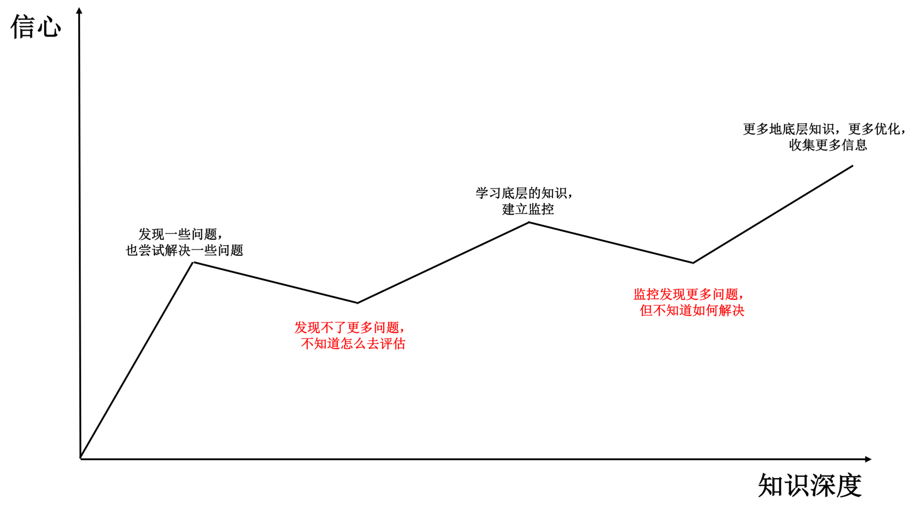

# 如何学习
> 打好基础，随时做好准备

### 基础

### 知识广度

### 学习过程

> 高手的道路应该也是不停向前演进的，可能刚开始时不一定是最好的，但是只要方向是正确的，终究可以到达“高手”这个终点。

# 移动开发方向

###高质量开发
- 性能优化，建立APM性能监控系统

###高效开发
- 持续交付、Devops 提升效率

- 跨平台开发可能是解决开发阶段的一个答案，动态部署可能是发布阶段的一个答案
  
###架构演进
> 对于一个应用来说，架构一定是核心中的核心
