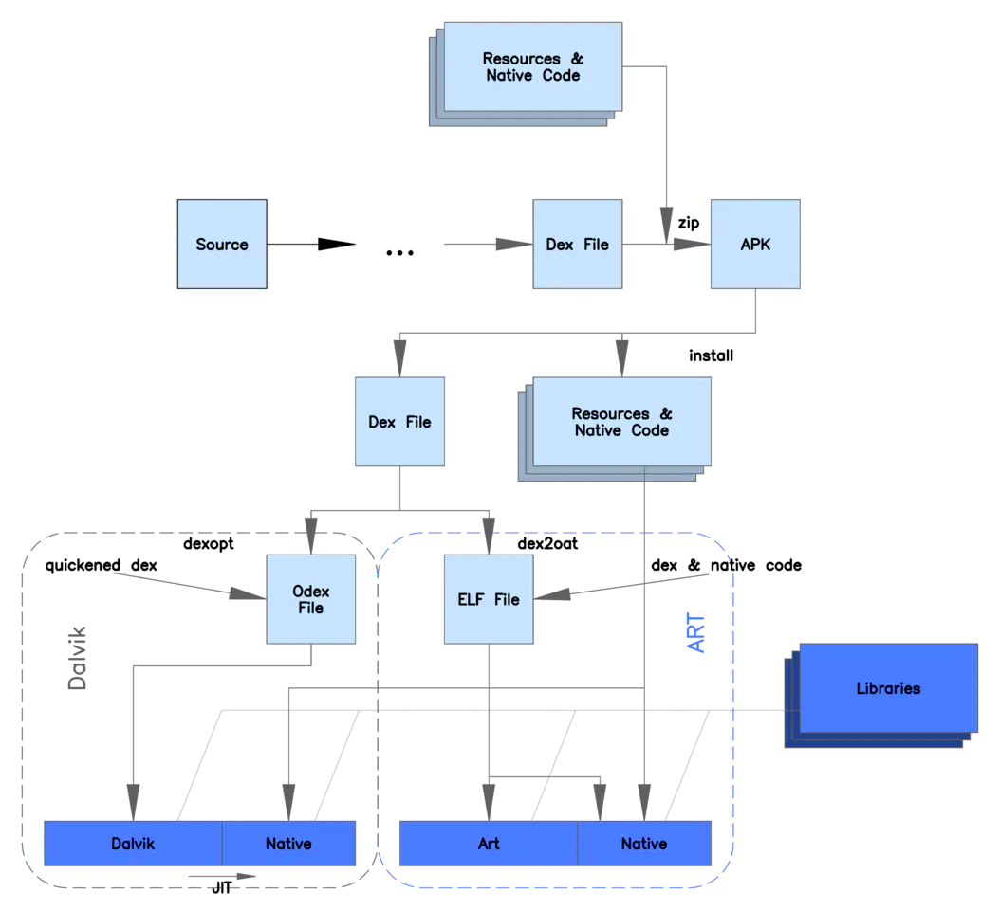
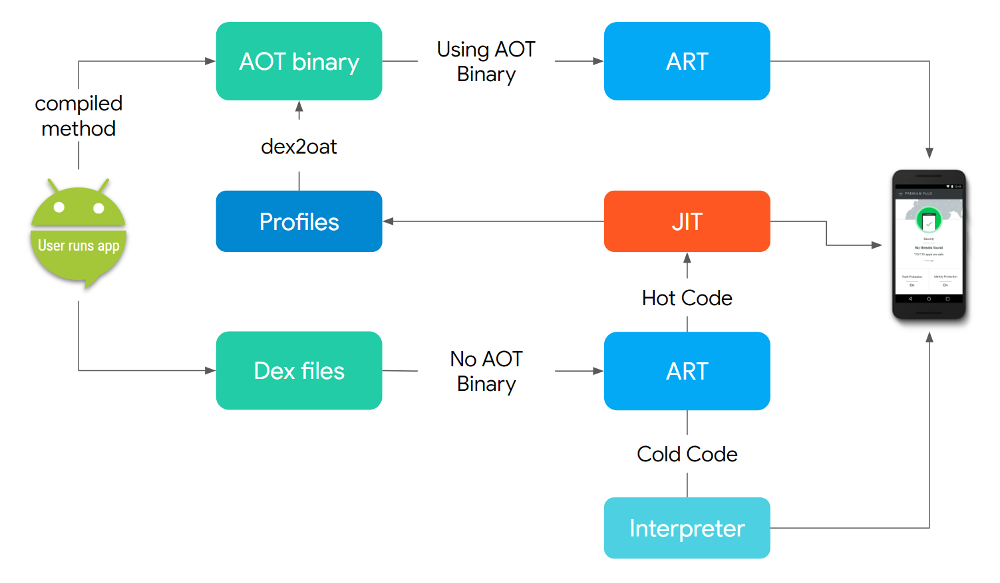
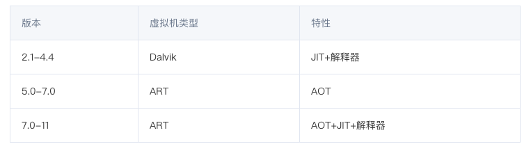
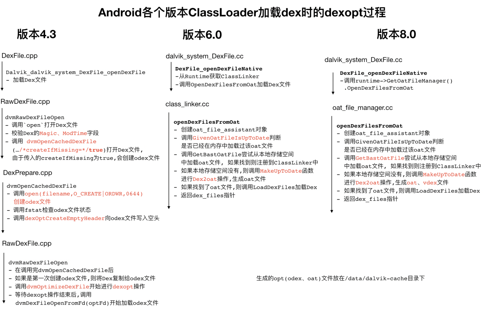
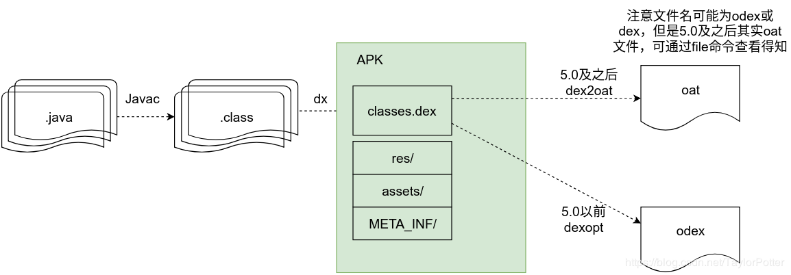

# Android运行时
> 类比Java虚拟机执行过程
> - Dex是专为Dalvik设计的一种压缩格式，适合内存和处理器速度有限的系统
> - Android基于寄存器（助记符指令更长，复杂，速度快） JVM基于栈（入、出栈较多，字节码指令简短，简单）
> - https://kingsfish.github.io/2019/10/03/%E8%B0%88%E8%B0%88Android%E7%BC%96%E8%AF%91%E8%BF%90%E8%A1%8C%E8%BF%87%E7%A8%8B/
> 
> 运行时也可以理解为 PMS安装APK流程（APK安装和运行区别是什么？）
> 
> 实践比较 Java ByteCode 和 Android Dex 字节码

# apk执行过程
> https://kingsfish.github.io/2019/10/03/%E8%B0%88%E8%B0%88Android%E7%BC%96%E8%AF%91%E8%BF%90%E8%A1%8C%E8%BF%87%E7%A8%8B/

> [使用配置文件引导的优化 (PGO)](https://source.android.google.cn/devices/tech/perf/pgo#using-pgo)

 

### JIT
> https://source.android.com/devices/tech/dalvik/jit-compiler 官方文章

### OSR
https://www.zhihu.com/question/45910849

#dalvik虚拟机
https://paul.pub/android-dalvik-vm/

#art虚拟机
https://paul.pub/android-art-vm/

#Dex相关
> https://skytoby.github.io/2019/Android%20dex%EF%BC%8Codex%EF%BC%8Coat%EF%BC%8Cvdex%EF%BC%8Cart%E6%96%87%E4%BB%B6%E7%BB%93%E6%9E%84/
- dex2oat工具(编译dex字节码为机器码) -> oat产物 5.0以上
  - vdex 8.0 其中包含 APK 的未压缩 DEX 代码，另外还有一些旨在加快验证速度的元数据
    > VDEX 文件有助于提升软件更新的性能和用户体验。VDEX 文件会存储包含验证程序依赖项且经过预验证的 DEX 文件，以便 ART 在系统更新期间无需再次解压和验证 DEX 文件。无需执行任何操作，即可实现该功能。该功能默认处于启用状态。要停用该功能，请将 ART_ENABLE_VDEX 环境变量设为 false。
  - odex：其中包含 APK 中已经过 AOT 编译的方法代码
  - art (optional)：其中包含 APK 中列出的某些字符串和类的 ART 内部表示，用于加快应用启动速度
    > art是一些类/filed/方法，app启动直接map到内存，从odex中拆分出来的,art文件主要为了加快应用的对“热代码”的加载与缓存
  - cdex(Compat Dex) 9.0
  - PGO  Profile Guided Optimization 10.0
- dexopt工具(对dex字节码进行优化) -> odex产物 5.0以下
- ReDex: An Android Bytecode Optimizer 

                           

#GC
> https://jasonzhong.github.io/2017/09/28/Android-%E6%B5%85%E6%9E%90-GC-%E5%9F%BA%E7%A1%80%E5%8E%9F%E7%90%86/

- 8.0GC改进
  - https://source.android.com/devices/tech/dalvik/improvements
  
#配置ART
https://source.android.com/devices/tech/dalvik/configure

dex2oat 工具的选项 从 Android O 开始，有四个官方支持的过滤器：                                                    
- verify：只运行 DEX 代码验证                                                                      
- quicken：运行 DEX 代码验证，并优化一些 DEX 指令，以获得更好的解译器性能                                              
- speed：运行 DEX 代码验证，并对所有方法进行 AOT 编译                                                  
- speed-profile：运行 DEX 代码验证，并对配置文件中列出的方法进行 AOT 编译

#面试知识点
- 运行时编译（安装时长、内存占用、运行性能、耗电量之间的平衡）
  - 解释执行 2.2以下
  - 解释+JIT 4.4以下
  - AOT或解释+JIT [4.4,5.0)
  - AOT [5.0,6.0]
  - AOT+解释+JIT（新型JIT服务AOT） 7.0以上
> JIT优先级高于AOT
> 
> JIT运行时编译 更加利于内联优化
> 
> 混合编译优点
 > - 即使是大应用，安装时间也能缩短到几秒
 > - 系统升级能更快地安装，因为不再需要优化这一步
 > - 应用的内存占用更小，有些情况下可以降低 50%
 > - 改善了性能
 > - 更低的电池消耗
 
- Oat文件、ODex文件
  - OAT文件本质上是一个ELF文件，因此在最外层它具有一般ELF文件的结构，例如它有标准的ELF文件头以及通过段（Section）来描述文件内容。OAT文件包含有两个特殊的段oatdata和oatexec，前者包含有用来生成本地机器指令的dex文件内容，后者包含有生成的本地机器指令，它们之间的关系通过储存在oatdata段前面的oat头部描述。
  - ODex Optimized DEX Apk在安装(installer)时，就会进行验证和优化，目的是为了校验代码合法性及优化代码执行速度，验证和优化后，会产生ODEX文件，运行Apk的时候，直接加载ODEX，避免重复验证和优化，加快了Apk的响应时间。

- GC
  - Dalvik CMS（会产生大规模停顿）
  - ART 
    - Q 引入分代回收 CC（并发复制）、CMS（并发标记清除）
    - 12 新的改进
  
- MultiDex原理
  - 5.0以下 ClassLoader 加载全部Dex文件（首次启动生效）
  - 5.0以上 不起作用 （OAT文件可以由多个Dex生成，即dex2oat直接将多个dex编译生成OAT）
