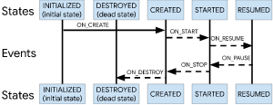

https://developer.android.com/jetpack/guide

#[LifeCycle](https://developer.android.com/topic/libraries/architecture/lifecycle)
1、event、state （抽象类Lifecycle）

lifecycle状态图

6类事件
onCreate、onStart、onResume
onDestory、onStop、onPause

5类状态
DESTROYED、INITIALIZED、CREATED、STARTED、RESUMED

2、LifecycleOwner 接口

3、*****LifecycleRegistry (Implementing a custom LifecycleOwner)

