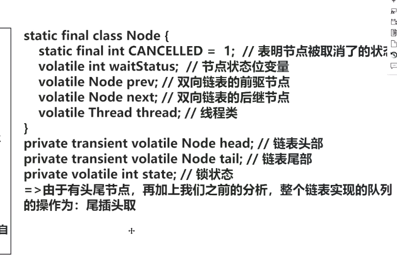

#Queue
> Java 并发包里面 Queue 这类并发容器是最复杂的，你可以从以下两个维度来分类。一个维度是**阻塞与非阻塞**，所谓阻塞指的是当队列已满时，入队操作阻塞；当队列已空时，出队操作阻塞。另一个维度是**单端与双端**，单端指的是只能队尾入队，队首出队；而双端指的是队首队尾皆可入队出队。Java 并发包里阻塞队列都用 Blocking 关键字标识，单端队列使用 Queue 标识，双端队列使用 Deque 标识。