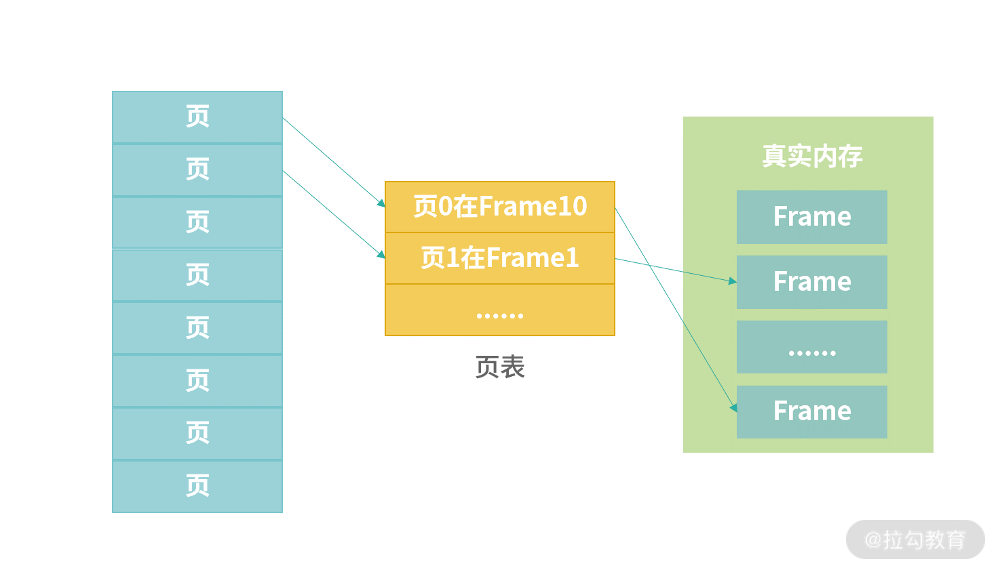

#基础知识

##Linux内核、Window内核

> 内核是操作系统中应用连接硬件设备的桥梁

##内存管理

>虚拟化技术中，应用使用的是虚拟内存，操作系统管理虚拟内存和真实内存之间的映射。操作系统将虚拟内存分成整齐小块，每个小块称为一个页（Page）。之所以这样做，原因主要有以下两个方面。

>一方面应用使用内存是以页为单位，整齐的页能够避免内存碎片问题。

>另一方面，每个应用都有高频使用的数据和低频使用的数据。这样做，操作系统就不必从应用角度去思考哪个进程是高频的，仅需思考哪些页被高频使用、哪些页被低频使用。如果是低频使用，就将它们保存到硬盘上；如果是高频使用，就让它们保留在真实内存中。

##进程管理

##IO

##文件系统

##上下文切换
> https://cloud.tencent.com/developer/article/1675399