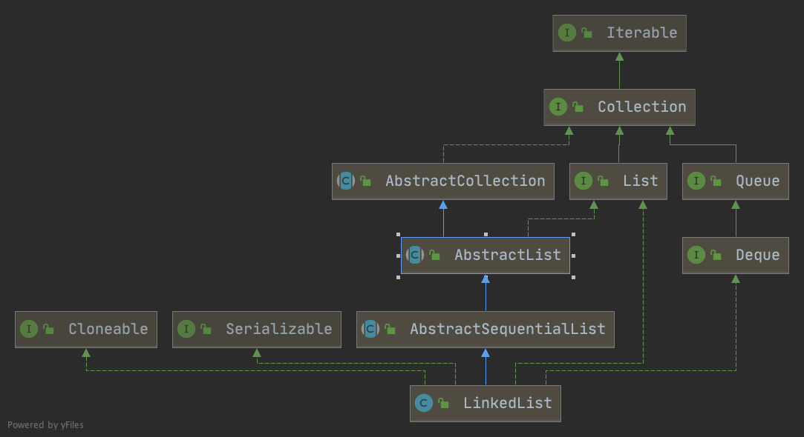

https://juejin.cn/post/6875841885735223310#heading-4

# ArrayList
> 大量使用了System.arraycopy方法

无参构造 延迟分配数组大小（调用add之后，初始化默认大小10）

扩容1.5倍（最大大小 Integer.max）

```java
private void ensureExplicitCapacity(int minCapacity) {
        modCount++;

        // overflow-conscious code
        if (minCapacity - elementData.length > 0)
            grow(minCapacity);
    }
```

```java
private void grow(int minCapacity) {
        // overflow-conscious code
        int oldCapacity = elementData.length;
        int newCapacity = oldCapacity + (oldCapacity >> 1);
        if (newCapacity - minCapacity < 0)
            newCapacity = minCapacity;
        if (newCapacity - MAX_ARRAY_SIZE > 0)
            newCapacity = hugeCapacity(minCapacity);
        // minCapacity is usually close to size, so this is a win:
        elementData = Arrays.copyOf(elementData, newCapacity);
    }

    private static int hugeCapacity(int minCapacity) {
        if (minCapacity < 0) // overflow
            throw new OutOfMemoryError();
        return (minCapacity > MAX_ARRAY_SIZE) ?
            Integer.MAX_VALUE :
            MAX_ARRAY_SIZE;
    }
```

MAX_ARRAY_SIZE = Integer.MAX_VALUE - 8(why?)

fail-fast (for each增强循环本质是iterator)

> ConcurrentModificationException 本质checkForComodification()

```java
final void checkForComodification() {
            if (modCount != expectedModCount)
                throw new ConcurrentModificationException();
        }
```

> Thus, in the face of concurrent modification, the iterator fails quickly and cleanly, rather than risking arbitrary, non-deterministic behavior at an undetermined time in the future.

# LinkedList
> 双向循环列表



```java
    /**
     * 从距离头尾最近开始遍历
     * Returns the (non-null) Node at the specified element index.
     */
    Node<E> node(int index) {
        // assert isElementIndex(index);

        if (index < (size >> 1)) {
            Node<E> x = first;
            for (int i = 0; i < index; i++)
                x = x.next;
            return x;
        } else {
            Node<E> x = last;
            for (int i = size - 1; i > index; i--)
                x = x.prev;
            return x;
        }
    }
```
```java
    /**
     * 删除节点
     * Unlinks non-null node x.
     */
    E unlink(Node<E> x) {
        // assert x != null;
        final E element = x.item;
        final Node<E> next = x.next;
        final Node<E> prev = x.prev;

        if (prev == null) {
            first = next;
        } else {
            prev.next = next;
            x.prev = null;
        }

        if (next == null) {
            last = prev;
        } else {
            next.prev = prev;
            x.next = null;
        }

        x.item = null;
        size--;
        modCount++;
        return element;
    }
```
```java
    /**
     * 插入节点
     * Inserts element e before non-null Node succ.
     */
    void linkBefore(E e, Node<E> succ) {
        // assert succ != null;
        final Node<E> pred = succ.prev;
        final Node<E> newNode = new Node<>(pred, e, succ);
        succ.prev = newNode;
        if (pred == null)
            first = newNode;
        else
            pred.next = newNode;
        size++;
        modCount++;
    }
```

# CopyOnWriteArrayList
```java
/** The array, accessed only via getArray/setArray. */
    private transient volatile Object[] array;
```
> Element-changing operations on iterators themselves ({@code remove}, {@code set}, and {@code add}) are not supported. These methods throw {@code UnsupportedOperationException}.

> 读写分离 读操作借助volatile array；写操作加锁且执行大量的Arrays.copyOf(temp, newlen)即System.arraycopy
> 
> COWIterator 迭代器构造时拷贝一份当前元素,外部对list的修改在迭代器中不可见
> 
> 保证最终一致性

# CopyOnWriteArraySet
> 对CopyOnWriteArrayList包装
```java
private final CopyOnWriteArrayList<E> al;
```
```java
    /**
     * Appends the element, if not present.
     *
     * @param e element to be added to this list, if absent
     * @return {@code true} if the element was added
     */
    public boolean addIfAbsent(E e) {
        Object[] snapshot = getArray();
        return indexOf(e, snapshot, 0, snapshot.length) >= 0 ? false :
            addIfAbsent(e, snapshot);
    }
```